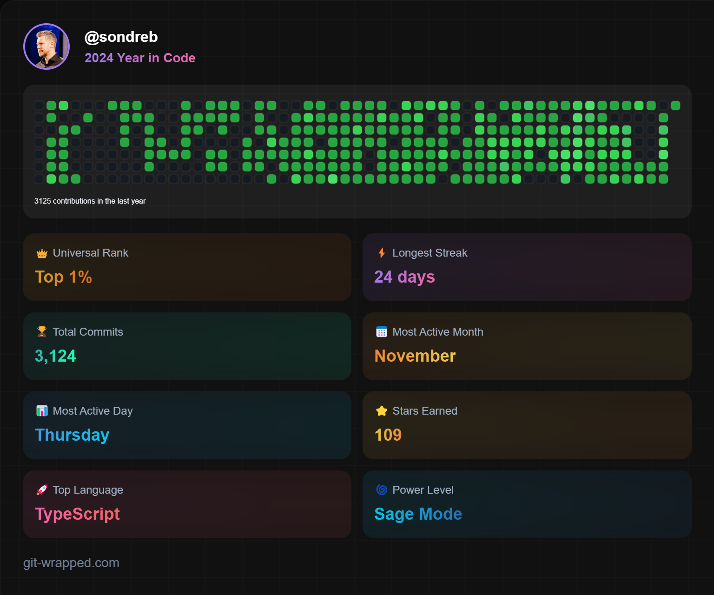

# Ćao, hello, hei! 💛🖤

### My name is ✨**Sondre**✨ and I do what I love: coding!

Try some of my apps: https://brainbox.no

Check my website if you want to learn more: https://sondreb.com

My goal is to be able to work full time on open source software, and I'm looking for job opportunities, [sponsors](https://github.com/sponsors/sondreb) and supporters that can help me achieve this goal.

You can also send me tips using ⚡Lightning (BTC): `sondreb@npub.cash`

Most of my time I dedicate to working on free open source projects that help propel humanity and the society forward in a positive direction ✌️.

- 🔨 I’m currently working on **[Nostria](https://www.nostria.app/)**, **[Angor](https://angor.io/)**, **[Blockcore](https://www.blockcore.net/)**, **[Brainbox](https://brainbox.no/)**, **[Ariton](https://ariton.app/)** (on-hold).

My years of experience contains stuff that don't exists anymore. What matters most is the ability to adapt and learn new skills. Here is my current list of preferred technologies (languages, software, technology, patterns) that I enjoy working lately:

### JavaScript, TypeScript, Progressive Web Apps, DevOps, DevEx, GitHub (Actions), Bitcoin, Ethereum, Web3, Web5, Nostr, Node.js, Docker, C#, .NET, ASP.NET, Kubernetes, MongoDB, RocksDB, Git, GitHub, Visual Studio Code, Azure (Cloud), Tauri, Electron, Cordova. ###

Fun fact: I do a little bit of everything, including building a new city [Liberstad](https://www.liberstad.com)🏡.

